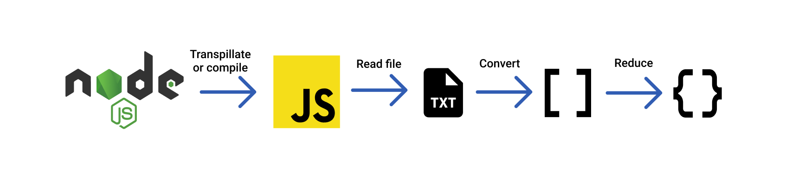

# :zap: Find employees within the same time frame

Problem resolved using [Node.js](https://nodejs.org/en/) and [Java Script](https://www.javascript.com/).

## :page_facing_up: Table of contents

- [Problem](#-problem)
- [Solution overview](#-screenshots)
- [Arquitecture](#-technologies)
- [Approach](#%EF%B8%8F-setup)
- [Setup](#-features)

## ❓ Problem
The company ACME offers their employees the flexibility to work the hours they want. But due to some external circumstances they need to know what employees have been at the office within the same time frame

The goal of this exercise is to output a table containing pairs of employees and how often they have coincided in the office.

Input: the name of an employee and the schedule they worked, indicating the time and hours. This should be a .txt file with at least five sets of data. You can include the data from our example below:

```txt
INPUT
RENE=MO10:00-12:00,TU10:00-12:00,TH01:00-03:00,SA14:00-18:00,SU20:00-21:00 
ASTRID=MO10:00-12:00,TH12:00-14:00,SU20:00-21:00
ANDRES=MO10:00-12:00,TH12:00-14:00,SU20:00-21:00

OUTPUT:
ASTRID-RENE: 2
ASTRID-ANDRES: 3
RENE-ANDRES: 2
```

## 💡 Solution overview
The solution is basically `to convert` the flat text from the `txt file` into an `array` and then `to reduce` this array to an `object` in order to store the employees who are within the same time frame.

## 🛠 Arquitecture


## 👏 Approach
The approach is to convert the flat text into an array since an array can be easier to manage, and it makes the use of high order functions like reduce or map posible.

## ⚙️ Setup
 ### requirements - Nodejs installed
 - Once installed Nodejs in the computer you must the steps as follow:
 - Open the project in your favorite editor
 - run `node index.js`
